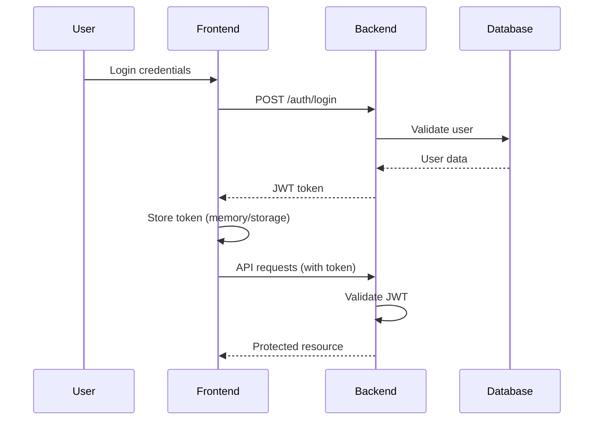

# 4n6NerdStriker Web Dashboard - Architecture & Implementation Plan

**Version**: 1.0.0  
**Date**: June 8, 2025  
**Status**: Planning Phase  

## 📋 Executive Summary

This document outlines the architecture and implementation plan for building a web-based dashboard for 4n6NerdStriker v1.3.0. The dashboard will provide a user-friendly interface for forensic collection operations, leveraging the production-ready KAPE, UAC, and Triage capabilities.

## 🎯 Project Goals

### Primary Objectives
- **Democratize Access**: Enable non-technical users to perform forensic collections
- **Improve Efficiency**: Reduce collection setup time from minutes to seconds
- **Enhance Visibility**: Real-time monitoring and progress tracking
- **Maintain Security**: Enterprise-grade security and audit capabilities
- **Preserve Functionality**: Full feature parity with CLI interface

### Success Metrics
- **User Adoption**: 90% of collections initiated via web interface
- **Time Reduction**: 75% reduction in collection setup time
- **Error Reduction**: 50% fewer user errors vs CLI
- **Reliability**: 99.9% dashboard uptime

## 🏗️ Technology Stack (Phase 1)

### Frontend Stack
```yaml
Framework: React 18 + TypeScript
Styling: Tailwind CSS 3.x
State Management: Zustand (lightweight alternative to Redux)
HTTP Client: Axios with React Query
Build Tool: Vite (faster than Create React App)
Components: Headless UI + Heroicons
```

### Backend Stack
```yaml
Framework: FastAPI 0.104+
Authentication: JWT tokens
Validation: Pydantic v2
Database: SQLite (dev) → PostgreSQL (prod)
ORM: SQLAlchemy 2.0 with Alembic migrations
Task Queue: Celery 5.x + Redis 7.x
Background Jobs: Celery workers
```

### Infrastructure
```yaml
Containerization: Docker + Docker Compose
Reverse Proxy: Nginx (production)
Process Manager: Gunicorn + Uvicorn workers
Monitoring: Basic logging (Phase 1)
```

## 🏛️ System Architecture

### High-Level Architecture
```
┌─────────────────┐    ┌─────────────────┐    ┌─────────────────┐
│                 │    │                 │    │                 │
│   React SPA     │────│   FastAPI       │────│   4n6NerdStriker │
│   (Frontend)    │    │   (Backend)     │    │   (Core Logic)  │
│                 │    │                 │    │                 │
└─────────────────┘    └─────────────────┘    └─────────────────┘
         │                       │                       │
         │              ┌─────────────────┐              │
         │              │                 │              │
         └──────────────│   Celery Queue  │──────────────┘
                        │   (Background)  │
                        │                 │
                        └─────────────────┘
                                 │
                        ┌─────────────────┐
                        │                 │
                        │   PostgreSQL    │
                        │   (Database)    │
                        │                 │
                        └─────────────────┘
```

### Component Architecture
```
falcon_dashboard/
├── backend/                      # FastAPI Backend
│   ├── app/
│   │   ├── api/v1/              # API Routes
│   │   │   ├── auth.py          # Authentication
│   │   │   ├── collections.py   # Collection endpoints
│   │   │   ├── hosts.py         # Host management
│   │   │   ├── jobs.py          # Job monitoring
│   │   │   └── results.py       # Results management
│   │   ├── core/                # Core Logic
│   │   │   ├── config.py        # Configuration
│   │   │   ├── security.py      # JWT/Auth logic
│   │   │   └── falcon_bridge.py # 4n6NerdStriker integration
│   │   ├── db/                  # Database
│   │   │   ├── models.py        # SQLAlchemy models
│   │   │   └── database.py      # DB connection
│   │   ├── schemas/             # Pydantic schemas
│   │   │   ├── collections.py   # Collection request/response
│   │   │   ├── hosts.py         # Host schemas
│   │   │   └── jobs.py          # Job schemas
│   │   └── tasks/               # Celery tasks
│   │       ├── collections.py   # Background collection tasks
│   │       └── monitoring.py    # Health check tasks
│   ├── alembic/                 # Database migrations
│   ├── tests/                   # Backend tests
│   └── requirements.txt         # Python dependencies
├── frontend/                    # React Frontend
│   ├── src/
│   │   ├── components/          # Reusable components
│   │   │   ├── ui/              # Basic UI components
│   │   │   ├── forms/           # Form components
│   │   │   └── layout/          # Layout components
│   │   ├── pages/               # Page components
│   │   │   ├── Dashboard.tsx    # Main dashboard
│   │   │   ├── Collections.tsx  # Collection wizard
│   │   │   ├── Jobs.tsx         # Job monitoring
│   │   │   ├── Results.tsx      # Results browser
│   │   │   └── Settings.tsx     # Configuration
│   │   ├── hooks/               # Custom React hooks
│   │   ├── services/            # API service layer
│   │   ├── stores/              # State management
│   │   ├── types/               # TypeScript definitions
│   │   └── utils/               # Utility functions
│   ├── public/                  # Static assets
│   ├── package.json             # Node dependencies
│   └── vite.config.ts           # Build configuration
├── docker/                      # Docker configurations
│   ├── backend.Dockerfile       # Backend container
│   ├── frontend.Dockerfile      # Frontend container
│   └── nginx.conf               # Reverse proxy config
├── docker-compose.yml           # Development environment
├── docker-compose.prod.yml      # Production environment
└── README.md                    # Setup instructions
```

## 🔗 4n6NerdStriker Integration

### Integration Strategy
The web dashboard will act as a **wrapper layer** around the existing 4n6NerdStriker v1.3.0, preserving all functionality while adding web accessibility.

### Bridge Architecture
```python
# backend/app/core/falcon_bridge.py
from forensics_nerdstriker import FalconForensicOrchestrator
from typing import Dict, List, Optional
import asyncio

class FalconBridge:
    """Bridge between web dashboard and 4n6NerdStriker"""
    
    def __init__(self):
        self.orchestrator = None
        self._initialize_orchestrator()
    
    def _initialize_orchestrator(self):
        """Initialize 4n6NerdStriker orchestrator"""
        self.orchestrator = FalconForensicOrchestrator(
            client_id=settings.FALCON_CLIENT_ID,
            client_secret=settings.FALCON_CLIENT_SECRET
        )
    
    async def get_hosts(self) -> List[Dict]:
        """Get available hosts from Falcon API"""
        # Leverage existing host discovery
        pass
    
    async def run_kape_collection(self, hostname: str, target: str) -> str:
        """Execute KAPE collection - returns job ID"""
        pass
    
    async def run_uac_collection(self, hostname: str, profile: str) -> str:
        """Execute UAC collection - returns job ID"""
        pass
    
    async def run_triage_collection(self, hosts: List[str]) -> str:
        """Execute triage collection - returns job ID"""
        pass
```

### Background Task Integration
```python
# backend/app/tasks/collections.py
from celery import Celery
from app.core.falcon_bridge import FalconBridge

celery_app = Celery("falcon_dashboard")

@celery_app.task(bind=True)
def execute_kape_collection(self, hostname: str, target: str, user_id: str):
    """Background task for KAPE collection"""
    bridge = FalconBridge()
    
    try:
        # Update task status
        self.update_state(
            state='PROGRESS',
            meta={'status': 'Initializing KAPE collection', 'progress': 10}
        )
        
        # Execute collection using existing 4n6NerdStriker
        success = bridge.orchestrator.run_kape_collection(
            hostname=hostname,
            target=target,
            upload=True
        )
        
        if success:
            self.update_state(
                state='SUCCESS',
                meta={'status': 'Collection completed successfully', 'progress': 100}
            )
        else:
            self.update_state(
                state='FAILURE',
                meta={'status': 'Collection failed', 'error': 'See logs for details'}
            )
            
    except Exception as exc:
        self.update_state(
            state='FAILURE',
            meta={'status': 'Collection failed', 'error': str(exc)}
        )
        raise
```

## 📊 Database Schema

### Core Tables
```sql
-- Users table (Phase 2)
CREATE TABLE users (
    id SERIAL PRIMARY KEY,
    username VARCHAR(50) UNIQUE NOT NULL,
    email VARCHAR(100) UNIQUE NOT NULL,
    hashed_password VARCHAR(255) NOT NULL,
    is_active BOOLEAN DEFAULT TRUE,
    created_at TIMESTAMP DEFAULT CURRENT_TIMESTAMP
);

-- Jobs table
CREATE TABLE jobs (
    id UUID PRIMARY KEY DEFAULT gen_random_uuid(),
    user_id INTEGER REFERENCES users(id),
    job_type VARCHAR(20) NOT NULL, -- 'kape', 'uac', 'triage', 'browser'
    status VARCHAR(20) DEFAULT 'pending', -- 'pending', 'running', 'completed', 'failed'
    progress INTEGER DEFAULT 0,
    hosts TEXT[] NOT NULL, -- Array of hostnames
    parameters JSONB NOT NULL, -- Collection parameters (target, profile, etc.)
    celery_task_id VARCHAR(255),
    started_at TIMESTAMP,
    completed_at TIMESTAMP,
    created_at TIMESTAMP DEFAULT CURRENT_TIMESTAMP,
    updated_at TIMESTAMP DEFAULT CURRENT_TIMESTAMP
);

-- Results table
CREATE TABLE results (
    id UUID PRIMARY KEY DEFAULT gen_random_uuid(),
    job_id UUID REFERENCES jobs(id),
    hostname VARCHAR(255) NOT NULL,
    success BOOLEAN NOT NULL,
    file_path VARCHAR(500), -- S3 path or local path
    file_size BIGINT,
    error_message TEXT,
    created_at TIMESTAMP DEFAULT CURRENT_TIMESTAMP
);

-- Host cache table (for performance)
CREATE TABLE hosts_cache (
    hostname VARCHAR(255) PRIMARY KEY,
    platform VARCHAR(20) NOT NULL,
    agent_version VARCHAR(50),
    last_seen TIMESTAMP,
    is_online BOOLEAN DEFAULT FALSE,
    updated_at TIMESTAMP DEFAULT CURRENT_TIMESTAMP
);
```

## 🔌 API Design

### RESTful API Endpoints
```python
# Collection Management
POST   /api/v1/collections/kape      # Create KAPE collection
POST   /api/v1/collections/uac       # Create UAC collection  
POST   /api/v1/collections/triage    # Create triage collection
POST   /api/v1/collections/browser   # Create browser collection

# Job Management
GET    /api/v1/jobs                  # List jobs (with pagination)
GET    /api/v1/jobs/{job_id}         # Get job details
GET    /api/v1/jobs/{job_id}/status  # Get job status (real-time)
DELETE /api/v1/jobs/{job_id}         # Cancel job
POST   /api/v1/jobs/{job_id}/retry   # Retry failed job

# Host Management
GET    /api/v1/hosts                 # List available hosts
GET    /api/v1/hosts/{hostname}      # Get host details
POST   /api/v1/hosts/refresh         # Refresh host cache

# Results Management
GET    /api/v1/results               # List collection results
GET    /api/v1/results/{result_id}   # Get result details
GET    /api/v1/results/{result_id}/download # Download collection file

# System
GET    /api/v1/health                # Health check
GET    /api/v1/stats                 # System statistics
```

### Request/Response Schemas
```python
# KAPE Collection Request
class KapeCollectionRequest(BaseModel):
    hostnames: List[str] = Field(..., min_items=1, max_items=50)
    target: str = Field(..., description="KAPE target (e.g., !BasicCollection)")
    upload: bool = Field(default=True, description="Upload to S3")
    
# UAC Collection Request  
class UacCollectionRequest(BaseModel):
    hostnames: List[str] = Field(..., min_items=1, max_items=50)
    profile: str = Field(..., description="UAC profile (e.g., ir_triage_no_hash)")
    upload: bool = Field(default=True, description="Upload to S3")

# Job Status Response
class JobStatusResponse(BaseModel):
    id: str
    status: str
    progress: int = Field(ge=0, le=100)
    current_host: Optional[str] = None
    total_hosts: int
    completed_hosts: int
    started_at: Optional[datetime] = None
    estimated_completion: Optional[datetime] = None
    results: List[JobResult] = []
```

## 🎨 Frontend Architecture

### Component Hierarchy
```
App.tsx
├── Layout/
│   ├── Header.tsx               # Navigation, user menu
│   ├── Sidebar.tsx              # Main navigation
│   └── Footer.tsx               # Status information
├── Pages/
│   ├── Dashboard.tsx            # Overview, quick actions
│   │   ├── QuickStats.tsx       # Recent jobs, system status
│   │   ├── QuickActions.tsx     # One-click collection buttons
│   │   └── RecentJobs.tsx       # Job history table
│   ├── Collections/
│   │   ├── CollectionWizard.tsx # Multi-step collection form
│   │   ├── HostSelector.tsx     # Host selection with search
│   │   ├── ProfileSelector.tsx  # KAPE/UAC profile selection
│   │   └── CollectionSummary.tsx # Review before execution
│   ├── Jobs/
│   │   ├── JobsList.tsx         # All jobs with filters
│   │   ├── JobDetails.tsx       # Individual job details
│   │   └── JobMonitor.tsx       # Real-time progress
│   └── Results/
│       ├── ResultsBrowser.tsx   # Browse collection files
│       ├── ResultsTable.tsx     # Tabular view with search
│       └── DownloadManager.tsx  # Download queue
└── Components/
    ├── ui/                      # Basic UI components
    │   ├── Button.tsx
    │   ├── Modal.tsx
    │   ├── ProgressBar.tsx
    │   └── StatusBadge.tsx
    └── forms/                   # Form components
        ├── HostMultiSelect.tsx
        ├── ProfileDropdown.tsx
        └── CollectionForm.tsx
```

### State Management Strategy
```typescript
// stores/jobStore.ts - Using Zustand
interface JobStore {
  jobs: Job[];
  activeJob: Job | null;
  fetchJobs: () => Promise<void>;
  createJob: (request: CollectionRequest) => Promise<string>;
  subscribeToJob: (jobId: string) => void;
  unsubscribeFromJob: (jobId: string) => void;
}

export const useJobStore = create<JobStore>((set, get) => ({
  jobs: [],
  activeJob: null,
  
  fetchJobs: async () => {
    const response = await api.get('/jobs');
    set({ jobs: response.data });
  },
  
  createJob: async (request) => {
    const response = await api.post('/collections/kape', request);
    return response.data.job_id;
  },
  
  subscribeToJob: (jobId) => {
    // WebSocket or polling implementation
  }
}));
```

## 🔒 Security Architecture

### Authentication Flow


### Security Measures
```python
# Security configuration
SECURITY_CONFIG = {
    "jwt_secret_key": "strong-random-key",
    "jwt_algorithm": "HS256",
    "jwt_expire_minutes": 480,  # 8 hours
    "password_hash_algorithm": "bcrypt",
    "cors_origins": ["http://localhost:3000"],  # Frontend URL
    "rate_limiting": {
        "collections": "10/minute",
        "auth": "5/minute"
    }
}

# API Key security for Falcon integration
FALCON_CONFIG = {
    "client_id": "env:FALCON_CLIENT_ID",
    "client_secret": "env:FALCON_CLIENT_SECRET",
    "api_base_url": "https://api.crowdstrike.com"
}
```

## 🚀 Development Plan

### Phase 1: MVP (2-3 weeks)
```yaml
Week 1: Backend Foundation
  - FastAPI setup with basic endpoints
  - Database models and migrations
  - 4n6NerdStriker integration bridge
  - Basic Celery task execution

Week 2: Frontend Foundation  
  - React setup with routing
  - Basic UI components
  - Collection wizard (simple form)
  - Job status polling

Week 3: Integration & Testing
  - End-to-end collection flow
  - Real-time progress updates
  - Error handling and user feedback
  - Basic testing and bug fixes
```

### Phase 1 Features
- ✅ **Host Selection**: Multi-select with search
- ✅ **KAPE Collections**: All 11 production-ready targets
- ✅ **UAC Collections**: All 8 profiles (including fixed ir_triage_no_hash)
- ✅ **Triage Collections**: Auto-OS detection
- ✅ **Job Monitoring**: Real-time progress tracking
- ✅ **Results Download**: Direct S3 download links
- ✅ **Basic Authentication**: Simple login system

### Phase 1 Success Criteria
1. **Functional Parity**: Can perform all CLI operations via web interface
2. **Reliability**: 99% success rate for collections initiated via web
3. **Usability**: Non-technical users can complete collections in <2 minutes
4. **Performance**: Dashboard loads in <3 seconds, real-time updates <1 second
5. **Security**: All API endpoints protected, sensitive data encrypted

## 📦 Deployment Strategy

### Development Environment
```yaml
# docker-compose.yml
version: '3.8'
services:
  frontend:
    build: 
      context: ./frontend
      dockerfile: ../docker/frontend.Dockerfile
    ports:
      - "3000:3000"
    volumes:
      - ./frontend:/app
      - /app/node_modules
    environment:
      - VITE_API_URL=http://localhost:8000

  backend:
    build:
      context: ./backend
      dockerfile: ../docker/backend.Dockerfile
    ports:
      - "8000:8000"
    volumes:
      - ./backend:/app
    environment:
      - DATABASE_URL=postgresql://user:pass@db:5432/falcon_dashboard
      - REDIS_URL=redis://redis:6379/0
      - FALCON_CLIENT_ID=${FALCON_CLIENT_ID}
      - FALCON_CLIENT_SECRET=${FALCON_CLIENT_SECRET}
    depends_on:
      - db
      - redis

  worker:
    build:
      context: ./backend
      dockerfile: ../docker/backend.Dockerfile
    command: celery -A app.tasks worker --loglevel=info
    volumes:
      - ./backend:/app
    environment:
      - DATABASE_URL=postgresql://user:pass@db:5432/falcon_dashboard
      - REDIS_URL=redis://redis:6379/0
      - FALCON_CLIENT_ID=${FALCON_CLIENT_ID}
      - FALCON_CLIENT_SECRET=${FALCON_CLIENT_SECRET}
    depends_on:
      - db
      - redis

  db:
    image: postgres:15
    environment:
      - POSTGRES_USER=user
      - POSTGRES_PASSWORD=pass
      - POSTGRES_DB=falcon_dashboard
    volumes:
      - postgres_data:/var/lib/postgresql/data

  redis:
    image: redis:7-alpine
    ports:
      - "6379:6379"

volumes:
  postgres_data:
```

### Production Considerations
```yaml
Production Checklist:
  Infrastructure:
    - [ ] Container orchestration (Docker Swarm/K8s)
    - [ ] Load balancer (Nginx/HAProxy)
    - [ ] SSL/TLS certificates
    - [ ] Database backup strategy
    - [ ] Log aggregation (ELK stack)
    
  Security:
    - [ ] Environment variable management
    - [ ] Secret rotation strategy
    - [ ] Network security (VPC/firewalls)
    - [ ] Regular security updates
    - [ ] Audit logging
    
  Monitoring:
    - [ ] Application monitoring (Prometheus/Grafana)
    - [ ] Error tracking (Sentry)
    - [ ] Performance monitoring (APM)
    - [ ] Health checks and alerting
```

## 🔧 Development Setup

### Prerequisites
```bash
# Required software
- Docker & Docker Compose
- Node.js 18+ & npm
- Python 3.10+
- Git

# 4n6NerdStriker requirements
- CrowdStrike API credentials
- AWS S3 access (for uploads)
```

### Quick Start Commands
```bash
# Clone and setup
git clone <repository>
cd falcon_dashboard

# Environment setup
cp .env.example .env
# Edit .env with your Falcon API credentials

# Start development environment
docker-compose up -d

# Frontend development (with hot reload)
cd frontend && npm run dev

# Backend development (with auto-reload)
cd backend && uvicorn app.main:app --reload
```

## 📊 Monitoring & Observability

### Key Metrics to Track
```python
# Application metrics
METRICS = {
    "collections": {
        "total_started": "counter",
        "total_completed": "counter", 
        "total_failed": "counter",
        "success_rate": "gauge",
        "avg_duration": "histogram"
    },
    "system": {
        "active_jobs": "gauge",
        "queue_length": "gauge",
        "worker_utilization": "gauge",
        "api_response_time": "histogram"
    },
    "forensics_nerdstriker": {
        "api_calls": "counter",
        "api_errors": "counter",
        "session_duration": "histogram"
    }
}
```

### Health Checks
```python
# backend/app/api/v1/health.py
@router.get("/health")
async def health_check():
    """Comprehensive health check"""
    return {
        "status": "healthy",
        "version": "1.0.0",
        "components": {
            "database": await check_database(),
            "redis": await check_redis(),
            "falcon_api": await check_falcon_api(),
            "worker_queue": await check_worker_queue()
        },
        "timestamp": datetime.utcnow()
    }
```

## 🎯 Migration Path to Enterprise (Phase 3)

### Technology Upgrades
```yaml
Frontend:
  Current: React + JavaScript
  Target: React + TypeScript + Next.js
  Benefits: Better type safety, SSR, performance

Backend:
  Current: FastAPI + SQLite
  Target: FastAPI + PostgreSQL + Redis Cluster
  Benefits: Scalability, high availability

Authentication:
  Current: Simple JWT
  Target: OAuth2 + RBAC + SSO integration
  Benefits: Enterprise integration, fine-grained permissions

Monitoring:
  Current: Basic logging
  Target: Prometheus + Grafana + ELK
  Benefits: Full observability, alerting, troubleshooting
```

### Enterprise Features Roadmap
```yaml
Phase 2 (4-6 weeks):
  - User management and RBAC
  - Collection scheduling
  - Advanced filtering and search
  - Audit logging and compliance
  - Performance optimizations

Phase 3 (6-8 weeks):
  - SSO integration (SAML/OIDC)
  - Multi-tenancy support
  - Advanced analytics and reporting
  - API rate limiting and quotas
  - Disaster recovery capabilities
```

## 📚 Success Metrics & KPIs

### User Experience Metrics
- **Time to First Collection**: <2 minutes for new users
- **Collection Success Rate**: >99% via web interface
- **User Error Rate**: <5% of collections require intervention
- **Dashboard Load Time**: <3 seconds on typical network

### Technical Metrics
- **API Uptime**: 99.9% availability
- **Job Queue Performance**: <30 second average queue time
- **Concurrent Users**: Support 50+ simultaneous users
- **Data Integrity**: 100% collection result accuracy

### Business Metrics
- **User Adoption**: 90% of collections via web interface within 6 months
- **Training Time Reduction**: 75% reduction in user onboarding time
- **Support Ticket Reduction**: 60% fewer collection-related tickets
- **Operational Efficiency**: 50% reduction in collection setup time

---

This architecture document provides a comprehensive roadmap for building the 4n6NerdStriker web dashboard. The modular design allows for incremental development while maintaining the flexibility to scale to enterprise requirements.

**Next Steps**: 
1. Review and approve architecture
2. Set up development environment
3. Begin Phase 1 implementation
4. Establish CI/CD pipeline
5. Define testing strategy